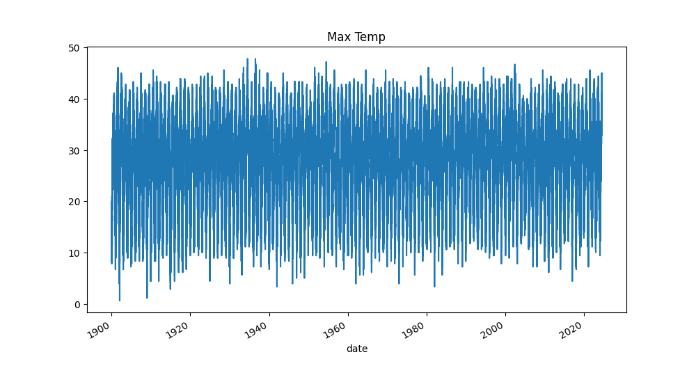

# US Historical Climate Network data downloader

[NOAA](https://www.ncei.noaa.gov/products/land-based-station/us-historical-climatology-network) maintains a [dataset of daily climate data](https://www.ncei.noaa.gov/pub/data/ghcn/daily/) for the US from 1875 to present. Data includes daily maximum and minimum temperatures, and precipitation, for 1,200 stations.

The daily raw data is a zipped text format that requires processing for further use:

```text
USC00011084192601TMAX-9999   -9999   -9999   -9999   -9999   -9999 ...
USC00011084192602TMIN   33  6   22  6   67  6    0  6   11  6   17 ...
USC00011084192602PRCP    0  6  381  6    0  6    0  6    0  6    0 ...
...
```

This repository provides a rust binary that downloads the data, unzips it, and saves it as an [Apache Parquet datafile](https://parquet.apache.org/). This file is easy to ingest into a Python dataframe for processing:

```text
                     id   tmax  tmin  prcp
date
1898-06-14  USC00324418   NaN    6.7   1.2
1898-06-15  USC00324418   NaN    7.8   0.0
1898-06-16  USC00324418   12.3   5.6   0.0
1898-06-17  USC00324418   14.4   8.9   0.1
1898-06-18  USC00324418   19.1   7.2   1.2
...
```

## Usage

```bash
> ghcn daily
Downloading
Unpacking
...
File saved to `/Users/richardlyon/ushcn-daily-2024-07-16.parquet`

> ghcn monthly
Downloading
Unpacking
...
File saved to `/Users/richardlyon/ushcn-monthly-2024-07-16.parquet`

> ghcn stations
Downloading
ile saved to `/Users/richardlyon/ghcnd-stations-2024-07-17.parquet`

```

Not included in this repository are any scripts for processing the data. However, as an example:

```python
import pandas as pd
import matplotlib.pyplot as plt

parquet_file_path = Path("/path/to/ghcnd_hcn.parquet")
df = pd.read_parquet(parquet_file_path)
df.set_index("date", inplace=True)
df = df.groupby(df.index)["tmax"].max()
df.plot(y="tmax", kind="line", title="Max Temp")
```


